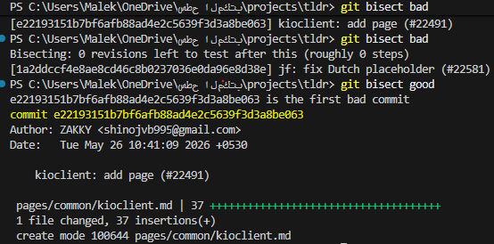

# Reproduce one issue on GitHub
Environment:

Device: Laptop  
OS: Windows 11
Browser: Google Chrome (latest version)  
Tools: IBM DevTools (as mentioned in the issue)  
Tested on: Live website  
 
Steps to reproduce:

Opened the live website.  
Navigated to the page containing the clipboard copy button.  
Inspected the button using IBM DevTools (Accessibility panel).  
Tested interaction using mouse and keyboard.  

Result:

The issue was successfully reproduced on the live website.  
The clipboard copy button shows an accessibility issue as described in the issue.

# Git bisect task

Git bisect is a binary search algorithm used to identify the commit that introduced a bug. 
It works by iteratively testing commits and marking them as either “good” or “bad,”
allowing Git to efficiently narrow down and locate the exact commit responsible for the issue.

