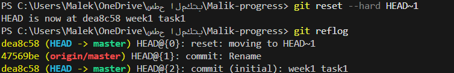

#  Git Archaeology Reflection
The commit points to a tree object, which represents the project’s directory at that exact moment, and that tree in turn links to blobs that store the actual file contents. Instead of saving full copies of files each time, Git breaks everything into these reusable objects connected by SHA-1 hashes, which makes the history both efficient and traceable. The parent field also showed how commits are linked in a chain, forming the project’s history

# Reflog Rescue Drill

